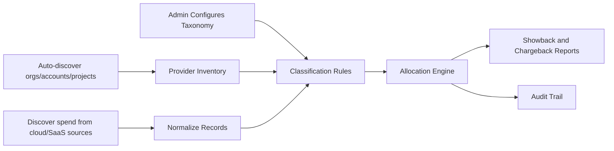

# Architecture

## Goal

Build a practical FinOps control plane for small to mid-sized companies that can normalize spend from cloud, SaaS, licenses, and other sources, then turn that data into showback and chargeback reports.

## Design principles

- Keep onboarding simple.
- Prefer configuration over custom code.
- Make allocation rules explicit and auditable.
- Support SMB realities: mixed billing sources, small teams, limited FinOps headcount, and imperfect tagging.
- Start lightweight, then evolve to stronger controls and integrations.

## Core domains

### 1. Admin and taxonomy
Admins define:

- cost categories: cloud, saas, licenses, other
- business units
- teams and cost centers
- owners and approvers
- allocation strategies for shared costs
- tagging requirements and exception handling

### 1b. Automatic discovery
The platform should not depend on manual entry for core cloud and account structure. Instead, it should pull from source systems:

- AWS Organizations and AWS Cost Explorer
- Azure tenant and subscriptions
- GCP organization, folders, and projects
- SaaS and license exports via CSV, API, or procurement feeds

The discovery layer converts these sources into a normalized client/account inventory so the rest of the platform can run on current org data.

### 2. Cost ingestion
The system accepts spend records from:

- cloud billing exports
- SaaS invoices
- license renewals
- manual CSV uploads
- API payloads from finance or procurement systems

### 2b. Source connectors
Each provider gets an adapter that knows how to:

- discover accounts, subscriptions, or projects
- pull spend data from the provider's billing source
- normalize metadata into the common cost model
- preserve source identifiers for auditability

### 3. Normalization and classification
Every incoming record is normalized into a common structure:

- source vendor
- source system
- category
- subcategory
- owner
- cost center
- environment
- amount and currency
- period
- allocation method
- confidence or rule source

### 4. Allocation engine
The engine applies a rule order:

1. explicit tag or vendor match
2. service mapping
3. cost center mapping
4. shared cost split rules
5. fallback to other/unclassified

This is the FinOps control point that turns messy spend into accountable spend.

### 5. Reporting
Reports should support:

- showback by team, project, and product
- chargeback by owner or cost center
- cloud versus SaaS versus licenses versus other splits
- budget variance and trend analysis
- shared cost breakdowns
- exceptions and unallocated spend

## Suggested implementation

### Backend
- FastAPI for API and admin operations
- Pydantic models for validation
- In-memory repository first, SQLite next

### Storage
- JSON files for initial config and sample data
- SQLite for persistent cost records and audit trail

### Reporting
- Simple summary endpoints first
- Exportable CSV/JSON later
- Optional dashboard later

## Request flow

## MVP scope

- Automatic discovery of cloud org/account structure
- Admin CRUD for taxonomy and allocation rules
- Cost item classification into cloud, SaaS, licenses, other
- Shared-cost splitting
- Summary report by category and owner
- Audit log of rule changes

## Later additions

- Budget alerts
- Commitment and subscription optimization
- Anomaly detection
- Multi-entity consolidation
- ERP and procurement integrations
- Role-based access control
- Scheduled reporting

## Why this fits SMB and mid-market

This design avoids heavy enterprise complexity. It gives small teams the minimum FinOps controls needed to allocate spend accurately while keeping the system understandable and maintainable.